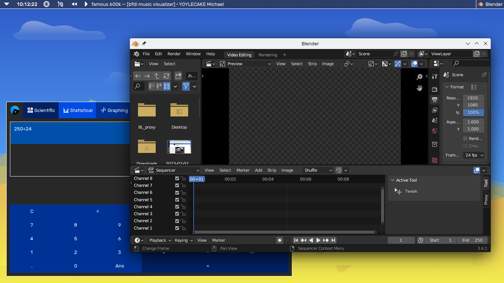
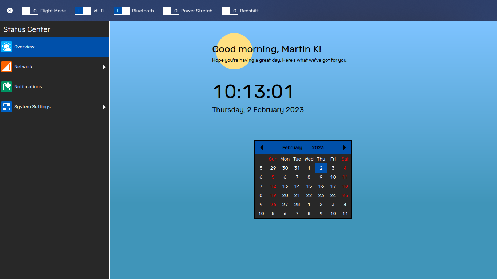
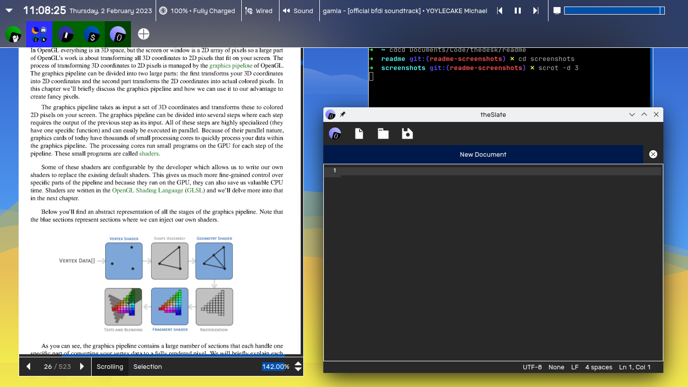
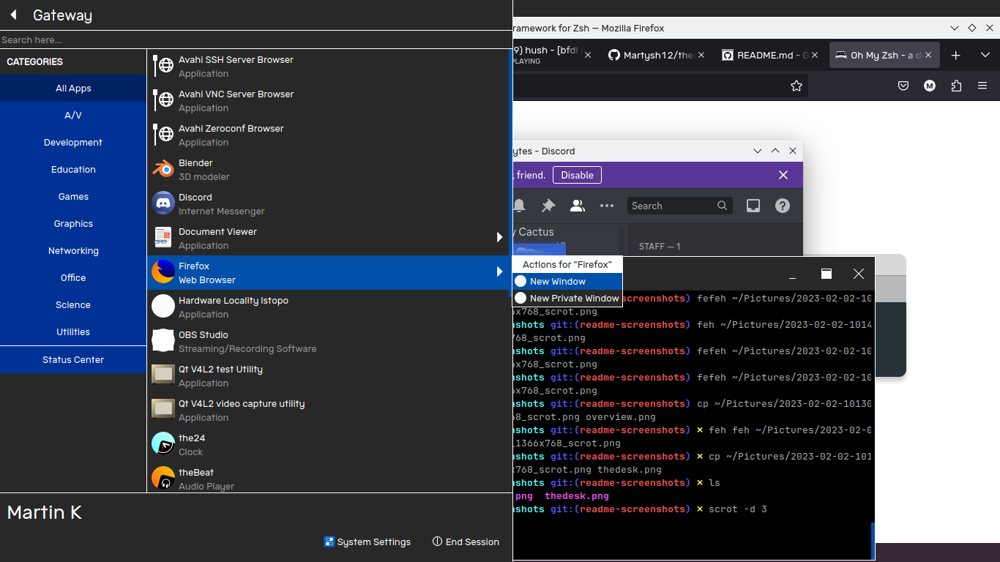

---
<p align="center">


</p>

theDesk is a desktop environment built on Qt libraries.

---

<p align="center">
 <br>
 <br>

</p>

# Dependencies
- Qt 5
  - Qt Core
  - Qt GUI
  - Qt Widgets
  - Qt SVG
- [the-libs](https://github.com/vicr123/the-libs)
- [libtdesktopenvironment](https://github.com/vicr123/libtdesktopenvironment)
- Xlib
- xorg-libinput
- NetworkManager-Qt

## Recommended Dependencies
- [contemporary-widgets](https://github.com/vicr123/contemporary-widgets) - the default widget theme
- [contemporary-icons](https://github.com/vicr123/contemporary-icons) - the default icon theme

## Build
Run the following commands in your terminal. 
```
mkdir build
qmake ../theDesk.pro
make
```

## Install
On Linux, run the following command in your terminal (with superuser permissions)
```
make install
```

---

> © Victor Tran, 2021. This project is licensed under the GNU General Public License, version 3, or at your option, any later version.
> 
> Check the [LICENSE](LICENSE) file for more information.
